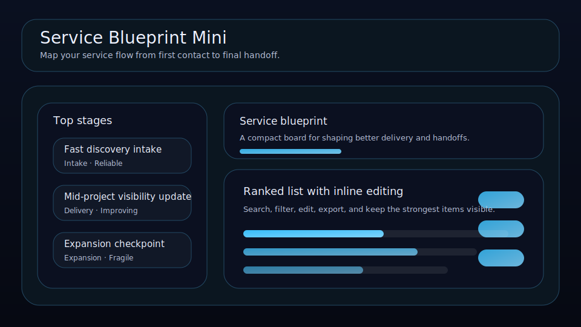

# Service Blueprint Mini

Map your service flow from first contact to final handoff.



Service Blueprint Mini is a local-first delivery board for consultants, agencies, and solo operators who want a clearer service journey. It makes weak handoffs, slow value moments, and fragile delivery steps visible before they start hurting trust.

## What it does

- ranks service stages by fragility, leverage, friction, and time-to-value
- tracks **owner**, **handoff**, **health**, and **time-to-value** for each stage
- highlights the weakest current step, the fastest value moment, and the highest leverage fix
- includes quick actions for strengthening a handoff, marking a stage reliable, and raising a red flag when service quality slips
- renders a weak-point queue and journey mix beneath the main board
- saves locally in the browser with JSON import/export backups

## Why it feels different

Service Blueprint Mini is not a generic task board. It is built around the client experience itself, so you can tune delivery flow, remove hidden friction, and make the service feel smoother from intake through expansion.

## Quick start

```bash
git clone https://github.com/get2salam/service-blueprint-mini.git
cd service-blueprint-mini
python -m http.server 8000
```

Then open <http://localhost:8000>.

## Keyboard shortcuts

- `N` creates a new stage
- `/` focuses the search box

## Data shape

```json
{
  "boardTitle": "Service blueprint",
  "items": [
    {
      "title": "Fast discovery intake",
      "category": "Intake",
      "state": "Reliable",
      "score": 9,
      "health": 8,
      "ttv": 30,
      "owner": "Founder",
      "handoff": "Discovery call -> scoped summary"
    }
  ]
}
```

## Privacy

Everything stays in your browser unless you export a JSON backup.

## License

MIT
